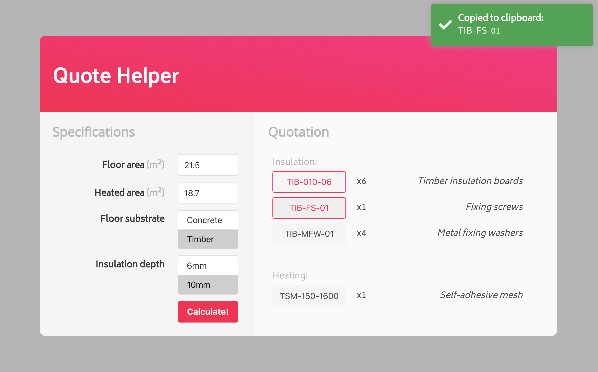

<p align="center">
  
</p>


**An app that generates information needed for underfloor heating quotations**
Quoting customers for UFH can be time-consuming. Lots of formulas to calculate, and stock codes to refer to, and each project has its own unique parameters to take into consideration. This app will take all the unique info about a project, and then display the stock codes and quantities to be used for quoting purposes.

## Screenshot

<p align="center">
  
</p>


## Getting started

1. Clone the repo
```
git clone https://github.com/VinRanana/UFH-Quote-Helper.git
cd UFH-Quote-Helper
```

2. Install dependencies
```
npm install
cd client
npm install
```

3. Start development server and open webpage
```
ng serve --open
```

4. Fill in fields and Calculate!


## Tech stack

* [Angular](https://angular.io/) - TypeScript-based front-end framework
* [Bulma](https://angular.io/) - Responsive CSS framework
* [Copy to clipboard](https://github.com/sudodoki/copy-to-clipboard) - Simple module for copy-to-clipboard function
* [ngx-toastr](https://github.com/scttcper/ngx-toastr) - Package for toast-style notfications in Angular


## Author

Davinder Rana - [Github](https://github.com/VinRanana) - [LinkedIn](https://www.linkedin.com/in/davinder-rana/)

